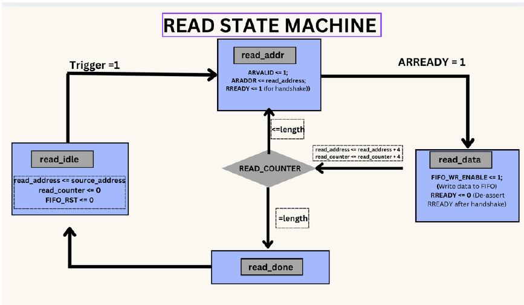
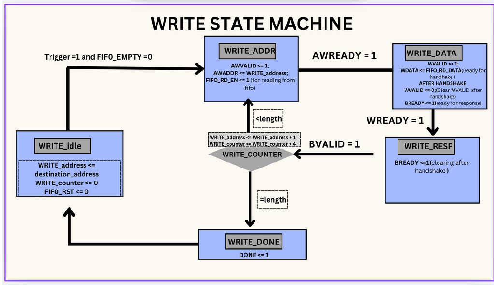

# AXI DMA Master Controller

This project implements a Direct Memory Access (DMA) controller using the AXI-Lite protocol. It supports both aligned and unaligned data transfers with FIFO buffering and handshaking logic, making it ideal for high-speed memory operations with minimal CPU involvement.

---

##  Key Design Features

- **Dual State Machines**  
  Separate read and write FSMs ensure reliable AXI handshakes and data integrity.
  
- **FIFO Buffering**  
  A 16-entry synchronous FIFO decouples reads and writes for parallel operation.

- **AXI-Lite Protocol**  
  Fully compliant handshaking: AR, R, AW, W, and B channels.

- **Configurable Transfer Length**  
  Controlled via `length` input. Flexible for dynamic transfer sizing.

- **Trigger-Based Control**  
  DMA begins on an external trigger signal.

- **Byte Address Conversion**  
  AXI uses byte addressing; this design converts word-based addresses accordingly.

---

##  State Machine Overview

### Read FSM

| State       | Description |
|-------------|-------------|
| `READ_IDLE` | Waits for trigger |
| `READ_ADDR` | Sends read address, waits for AXI acceptance |
| `READ_DATA` | Receives data, pushes into FIFO |
| `READ_DONE` | Wraps up transaction |

### Write FSM

| State         | Description |
|---------------|-------------|
| `WRITE_IDLE`  | Waits for data in FIFO & trigger |
| `WRITE_ADDR`  | Sends write address |
| `WRITE_DATA`  | Writes data from FIFO to AXI |
| `WRITE_RESP`  | Waits for response |
| `WRITE_DONE`  | Completes write transaction |

---

## FIFO Architecture

- **Depth**: 16 entries
- **Signals**:
  - `FIFO_WR_ENABLE`, `FIFO_RD_EN`
  - `FIFO_EMPTY`, `FIFO_FULL`
  - `FIFO_WR_PTR`, `FIFO_RD_PTR`

---

## Unaligned DMA Transfer Support

### Core Innovations

- Dual `src_offset` and `dst_offset` support  
- Dynamic `WSTRB` generation for partial writes  
- Packed read/write handling via `READ_PACK` and `WRITE_PACK` states  

### Helper Functions

| Function         | Purpose |
|------------------|---------|
| `align_to_word()`| Aligns address to 4-byte boundary |
| `get_offset()`   | Returns byte offset |
| `packed_word()`  | Packs bytes for FIFO entry |

---

## FSM Flow for Unaligned Transfers

### Read FSM
- States: `IDLE → ADDR → DATA → PACK → DONE`
- Merges unaligned words into 32-bit FIFO entries

### Write FSM
- States: `IDLE → ADDR → DATA → PACK → RESP → DONE`
- Shifts & masks unaligned data using `WSTRB`

---

## Example: Transfer with Offset

- **Source**: `0x1002`, **Destination**: `0x2003`, **Length**: 10 bytes

**Read:**
- Reads from `0x1000`, extracts bytes at offset
- Packs: `0x3344AABB`

**Write:**
- Shifts packed word using `dst_offset = 3`
- Sets `WSTRB = 4'b0001` to write single byte

---

## Testing Strategy

- Unaligned edge cases (`offset = 1, 2, 3`)
- Non-multiple-of-4 lengths (`1B`, `5B`, `17B`)
- Dynamic `WSTRB` verification via simulation

---

## Included Docs

-  [`DMA_Project_Report.pdf`](./DMA_Project_Report.pdf)
-  [`DMA_Presentation.pptx`](./DMA_Presentation.pptx)

---

##  Usage

To simulate or synthesize:
- Instantiate the `dma_axi_master` module
- Provide aligned/unaligned addresses
- Set `length` and toggle `trigger`
- Observe `FIFO` and `AXI` signals for transaction flow

---

## Notes

- All resets are **synchronous**
- Supports full AXI-Lite read/write flow
- Ideal for embedded memory transfers, sensor data handling, and network buffers

