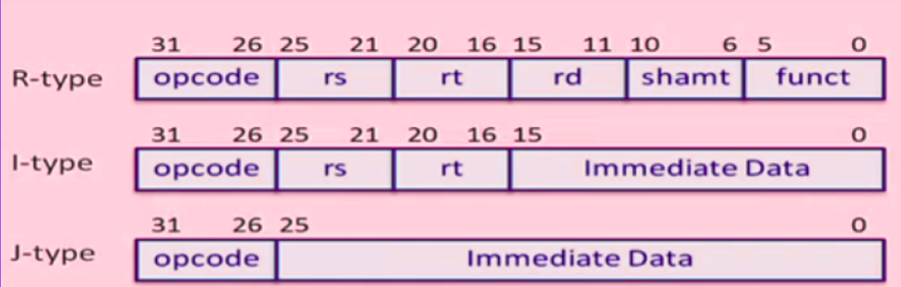
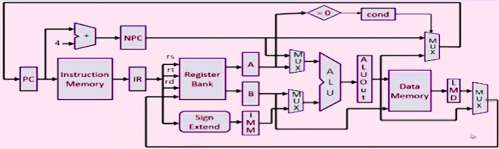
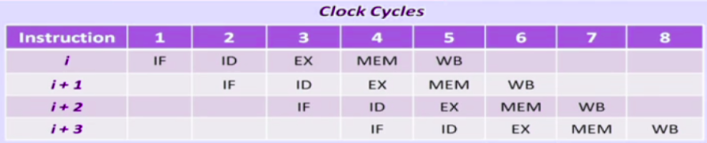

# 5-Stage Pipelined MIPS32 Processor  
**Built using Verilog | RTL-based CPU Design | NPTEL Guided Project**

## Overview

This project is a custom-designed 32-bit **5-stage pipelined MIPS32 processor**, developed as part of the NPTEL course *Hardware Modeling using Verilog* by **Prof. Indranil Sengupta**. It supports MIPS-style instructions and handles various pipeline hazards using efficient architectural techniques.

The processor simulates instruction execution through five stages:  
**IF → ID → EX → MEM → WB**, with custom hazard resolution mechanisms for **data**, **control**, and **structural hazards**.

---

## Key Features

- Fully functional **32-bit pipelined CPU** in Verilog
- Supports 14 custom MIPS-style instructions (R-type, I-type, load/store, branch, halt)
- Efficient handling of **data**, **control**, and **structural hazards**
- Branch resolution using **early condition check** and **pipeline flushing**
- Memory and instruction storage using **separate modules**
- Two-phase clocking system to separate pipeline stages

---

## Instruction Set

| Opcode   | Instruction     | Type     | Description                             |
|----------|------------------|----------|-----------------------------------------|
| `000000` | ADD              | RR-ALU   | Register-register addition              |
| `000001` | SUB              | RR-ALU   | Register-register subtraction           |
| `000010` | AND              | RR-ALU   | Bitwise AND                             |
| `000011` | OR               | RR-ALU   | Bitwise OR                              |
| `000100` | SLT              | RR-ALU   | Set less than                           |
| `000101` | MUL              | RR-ALU   | Multiplication                          |
| `001000` | LW               | LOAD     | Load word from memory                   |
| `001001` | SW               | STORE    | Store word to memory                    |
| `001010` | ADDI             | RM-ALU   | Add immediate                           |
| `001011` | SUBI             | RM-ALU   | Subtract immediate                      |
| `001100` | SLTI             | RM-ALU   | Set less than immediate                 |
| `001101` | BNEQZ            | BRANCH   | Branch if not equal to zero             |
| `001110` | BEQZ             | BRANCH   | Branch if equal to zero                 |
| `111111` | HLT              | HALT     | Halt the processor                      |

---

## Architecture Details

### Pipelined Stages

1. **IF (Instruction Fetch)**  
   Fetches instruction from memory and calculates next PC.

2. **ID (Instruction Decode & Register Fetch)**  
   Decodes opcode, reads registers, and performs sign extension for immediate values.

3. **EX (Execution/Address Calculation)**  
   Executes ALU operations or computes branch target addresses.

4. **MEM (Memory Access)**  
   Loads data from memory or writes to memory.

5. **WB (Write Back)**  
   Writes result back to register file.

---

## Hazard Handling

- **Data Hazards**  
  Mitigated using two-phase clocking and **controlled stalling** to allow operand availability.

- **Control Hazards**  
  Branch condition is evaluated **early in EX stage**. If the branch is taken, **IF and ID stages are flushed**, reducing penalties.

- **Structural Hazards**  
  Avoided using **separate instruction and data memories**, and a **two-port register file** enabling concurrent reads and writes.

---

## Design Decisions

- Inter-stage pipeline registers (e.g., `IF_ID_IR`, `ID_EX_A`) store intermediate values and signals.
- Control signals are abstracted using `TYPE` parameters for stage-aware decoding.
- Memory is implemented as a 1KB array: `Mem[1023:0]`.
- Register file contains 32 registers: `Reg[31:0]`.

---

## Technologies Used

- **Verilog HDL**
- **RTL Design**
- **Digital Logic and Computer Architecture**
- Simulation tools: **ModelSim**, **Xilinx Vivado** (or any compatible Verilog simulator)

---

## Project Highlights

- Built a working pipelined processor with support for branching, arithmetic, and memory operations
- Implemented clean pipeline stage isolation with intermediate registers
- Integrated hazard handling logic with minimal pipeline stalling
- Applied early branch resolution and pipeline flushing for control hazards

---

## How to Run

1. Load the Verilog source files into a Verilog simulator (e.g., ModelSim, Vivado).
2. Initialize the `Mem` array with binary instruction data.
3. Toggle the two clock inputs (`clk1`, `clk2`) alternately to simulate pipeline flow.
4. Observe internal pipeline registers (`IF_ID_IR`, `ID_EX_A`, etc.) to track instruction movement.
5. Monitor `Reg` and `Mem` arrays to view results.

