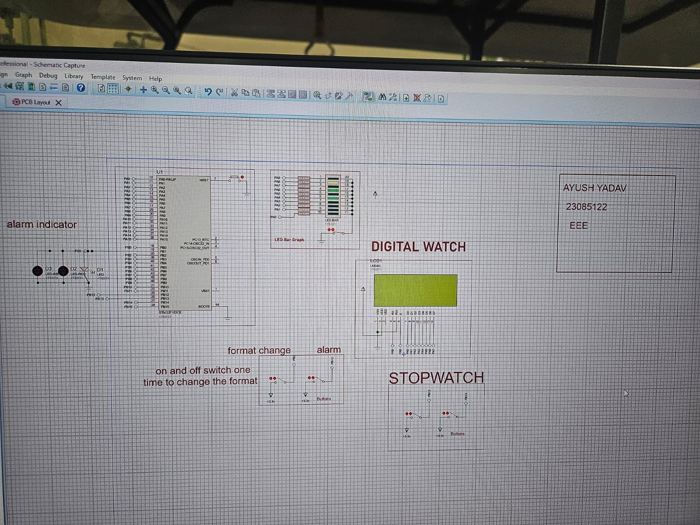

# STM32F1 Digital Clock

## Overview
This project implements a digital clock using the STM32F1 microcontroller and STM32 HAL libraries. The system includes real-time timekeeping, an alarm feature, a stopwatch, and the ability to toggle between 12-hour and 24-hour display formats. The design was simulated and tested using Proteus.

## Features
- Real-time clock using the built-in RTC peripheral
- Alarm display with time-matched trigger
- Stopwatch functionality with start/stop and reset controls
- Toggle between 12-hour and 24-hour time formats
- LCD display (8-bit mode) for time, alarm, and stopwatch output
- Software button debouncing for stable and noise-free input handling

## Key Components
- **Microcontroller**: STM32F103C8T6 (Blue Pill)
- **LCD Display**: 16x2 character LCD using 8-bit parallel interface
- **Buttons**: Used for toggling format, enabling/disabling alarm, and controlling the stopwatch
- **RTC**: Hardware RTC peripheral configured with LSI clock
- **Alarm Output**: GPIO pin used to simulate alarm signal

## Implementation Details
- Time is displayed using `HAL_RTC_GetTime` and `HAL_RTC_GetDate`, with formatted output on the LCD.
- Alarm is set using `HAL_RTC_SetAlarm` and continuously checked against the current time. When triggered, a GPIO pin is set high for 2 seconds.
- Stopwatch logic is implemented using `HAL_GetTick` to track elapsed time in a non-blocking manner.
- Button inputs are debounced in software using edge detection and delay logic to prevent false triggers.
- The system uses state flags to manage modes (e.g., stopwatch running/stopped, alarm on/off, format toggle).

## Tools and Technologies
- STM32 HAL (Hardware Abstraction Layer)
- STM32CubeMX for peripheral initialization
- Keil uVision / STM32CubeIDE for code development
- Proteus VSM for circuit simulation and testing

## Notes
- The system uses RTC in BCD mode for both timekeeping and alarms.
- The LCD displays three rows: current time, alarm time (if enabled), and stopwatch time.
- GPIO pin mappings are configured in `MX_GPIO_Init()` based on Proteus simulation schematic.
